<div align="center">


# PowerShell Profile — LinhDangDev

**A batteries-included PowerShell profile for Windows web developers.**  
Ghost-text autocomplete · Git one-liners · Yarn/Node shortcuts · Docker utils · Smart `cd` · Port killer · `.env` loader

[](./Microsoft.powershell_profile.ps1)
[](./themes/iterm2.omp.json)
[](./LICENSE)
[](.)

</div>

---

## What's inside

| Feature | Description |
|---------|-------------|
| [Ghost Text Autocomplete](#-autocomplete--keyboard-shortcuts) | Inline suggestions from history — `→` word, `End` full |
| [Git Shortcuts](#-git-shortcuts) | `gs`, `glog`, `gco`, `gcp "msg"` and more |
| [Yarn / Node Shortcuts](#-yarn--node-shortcuts) | `yd`, `yt`, `ytw`, `yb`, `yi`, `nvv` |
| [Docker Helpers](#-docker-helpers) | `dps` colored table, `dex` fuzzy exec, `dmon` TUI |
| [Port Killer](#-utility-functions) | `kp 3000` — kill anything on a port instantly |
| [.env Loader](#-utility-functions) | `le` — load `.env` into current session |
| [Zoxide Smart cd](#-zoxide--smart-cd) | `z vsense` jumps straight to your project |
| [Unix helpers](#-utility-functions) | `which`, `mkcd`, `up`, `touch` |
| [DB / Drizzle helpers](#-drizzle--db-helpers) | `db-push`, `db-gen`, `db-studio` |
| [UTF-8 fix](#-utf-8-fix) | Fixes garbled output from yarn/vitest/node |

---

## Prerequisites

```powershell
# 1. Oh My Posh
winget install JanDeDobbeleer.OhMyPosh -s winget

# 2. A Nerd Font (needed for icons in the prompt)
oh-my-posh font install
# Restart terminal, then set the font in Settings -> Appearance

# 3. Terminal Icons
Install-Module -Name Terminal-Icons -Scope CurrentUser -Force

# 4. PSReadLine (update to latest)
Install-Module -Name PSReadLine -Scope CurrentUser -Force -AllowPrerelease

# 5. Zoxide — smart cd
winget install ajeetdsouza.zoxide

# 6. (Optional) lazydocker TUI
winget install JesseDuffield.lazydocker

# 7. (Optional) Desktop notifications
Install-Module BurntToast -Scope CurrentUser
```

---

## Installation

```powershell
# Clone this repo
git clone https://github.com/LinhDangDev/Config-Oh-My-Posh.git

# Copy profile to your PowerShell profile location
Copy-Item .\Config-Oh-My-Posh\Microsoft.powershell_profile.ps1 $PROFILE -Force

# Copy iterm2 theme (used by default in the profile)
$themeDest = "$env:LOCALAPPDATA\Programs\oh-my-posh\themes\"
Copy-Item .\Config-Oh-My-Posh\themes\iterm2.omp.json $themeDest -Force

# Reload profile
. $PROFILE
```

> **Execution policy error?** Run this first:
> ```powershell
> Set-ExecutionPolicy -ExecutionPolicy RemoteSigned -Scope CurrentUser
> ```

---

## 🎯 Autocomplete & Keyboard Shortcuts



| Key | Action |
|-----|--------|
| `→` at end of line | Accept **next word** of ghost suggestion |
| `End` | Accept **entire** ghost suggestion |
| `Ctrl+→` | Accept next suggestion word |
| `Tab` / `Shift+Tab` | Cycle file / folder completions |
| `F2` | Toggle **ghost text** ↔ **list view** history |
| `F6` | Open function picker (Out-GridView) |
| `F7` | Open command history picker |
| `↑` / `↓` | Search history by current prefix |
| `Alt+w` | Save line to history without executing |

PSReadLine color scheme — Commands `cyan`, strings `yellow`, variables `green`, errors `red`.

---

## 🔀 Git Shortcuts



| Shortcut | Equivalent |
|----------|-----------|
| `gs` | `git status -sb` |
| `glog` | `git log --oneline --graph --decorate -20` |
| `gco <branch>` | `git checkout <branch>` |
| `gcb <name>` | `git checkout -b <name>` |
| `gaa` | `git add -A` |
| `gd` | `git diff` |
| `gp` | `git push` |
| `gpl` | `git pull --rebase` |
| `gst` | `git stash` |
| `gsp` | `git stash pop` |
| `gcp "message"` | `git add -A && git commit -m "…" && git push` |

> **Autocorrect:** Typing `git cmt` is automatically corrected to `git commit`.

---

## 🧶 Yarn / Node Shortcuts

| Shortcut | Equivalent |
|----------|-----------|
| `yd` | `yarn dev` |
| `yda` | `yarn dev:api` |
| `ydw` | `yarn dev:web` |
| `yt` | `yarn test` |
| `ytw` | `yarn test --watch` |
| `yb` | `yarn build` |
| `yi` | `yarn install` |
| `nvv` | Print `node` + `yarn` versions |

---

## 🐳 Docker Helpers

| Shortcut | Description |
|----------|-------------|
| `dps` | Colored running container table (green=Up, red=Exited) |
| `dex <name>` | `docker exec -it <fuzzy-name> sh` — partial name match |
| `dmon` | Launch `lazydocker` TUI |
| `dl-split <c1> <c2>` | Open container logs side-by-side in new WT panes |
| `dl-paste` | Read `docker logs` commands from clipboard, split panes |

---

## 🛠 Utility Functions



### `kp` — Kill a port

```powershell
kp 3001
# Killed PID 18432 on :3001
```

### `le` — Load `.env` into session

```powershell
le              # loads .env
le .env.local   # loads a specific file
$env:DATABASE_URL   # use any loaded var immediately
```

### `mkcd` — Create directory and `cd` into it

```powershell
mkcd src/features/payments
# dir created + navigated in one step
```

### `up` — Go up N directories

```powershell
up      # go up 1 level
up 3    # go up 3 levels at once
```

### `touch` — Create file (Unix-style)

```powershell
touch src/utils/helpers.ts   # creates file (or updates timestamp)
```

### `which` — Locate a command

```powershell
which node
# Name  CommandType  Source
# node  Application  C:\Program Files\nodejs\node.exe
```

### `c.` — Open VS Code

```powershell
c.                # open VS Code in current folder
c src/index.ts    # open a specific file
```

### `show-env` — List env vars with optional filter

```powershell
show-env DATABASE
# DATABASE_URL  postgresql://localhost:5432/vsense_dev
```

### `notify` — Desktop notification after long command

```powershell
notify { yarn build }
# ... build runs ...
# Windows toast: "Task finished — Completed in 12.3s"
```

---

## 🗄 Drizzle / DB Helpers

| Shortcut | Equivalent |
|----------|-----------|
| `db-push` | `yarn drizzle-kit push` |
| `db-gen` | `yarn drizzle-kit generate` |
| `db-studio` | `yarn drizzle-kit studio` |

---

## ⚡ Zoxide — Smart `cd`

```powershell
# Install once:
winget install ajeetdsouza.zoxide

# Usage — jumps to the most-visited matching path:
z vsense     # -> D:\Vsense\Vsense_Shop\Eccomere\Vsense_Shop
z api        # -> ...\apps\api
z docs       # -> whichever docs folder you visit most
```

---

## 🔤 UTF-8 Fix

Fixes garbled output (`Γ£ô` -> `✓`) from `yarn`, `vitest`, `node` on Windows.

Added at the very top of the profile:

```powershell
[Console]::InputEncoding  = [System.Text.Encoding]::UTF8
[Console]::OutputEncoding = [System.Text.Encoding]::UTF8
$OutputEncoding           = [System.Text.Encoding]::UTF8
chcp 65001 | Out-Null
$env:LANG       = "en_US.UTF-8"
$env:PYTHONUTF8 = "1"
```

---

## 🔄 Keeping the profile in sync

After editing `$PROFILE` locally, push changes back to this repo:

```powershell
git clone https://github.com/LinhDangDev/Config-Oh-My-Posh.git
Copy-Item $PROFILE .\Config-Oh-My-Posh\Microsoft.powershell_profile.ps1 -Force
cd Config-Oh-My-Posh
git add Microsoft.powershell_profile.ps1
git commit -m "feat(profile): describe your changes"
git push origin main
```

---

<div align="center">
  <sub>Built with <a href="https://ohmyposh.dev">Oh My Posh</a> · <a href="https://github.com/PowerShell/PSReadLine">PSReadLine</a> · <a href="https://github.com/ajeetdsouza/zoxide">zoxide</a> · <a href="https://github.com/devblackops/Terminal-Icons">Terminal-Icons</a></sub>
</div>
